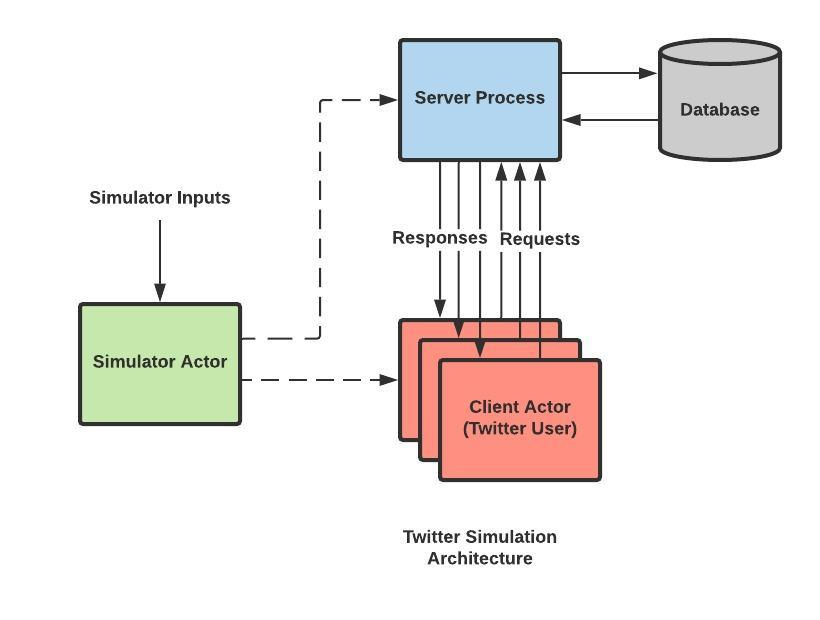
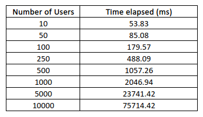
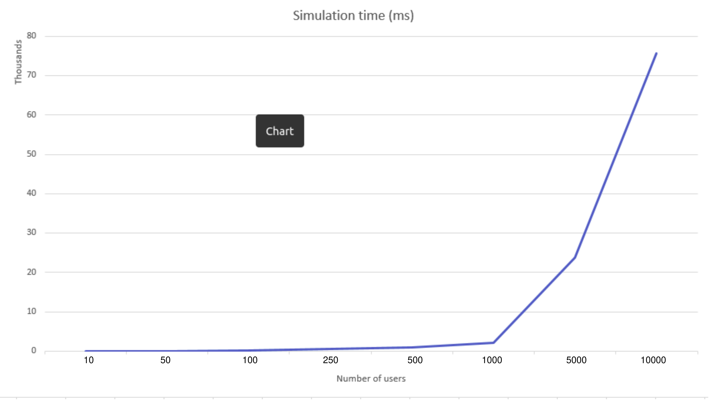
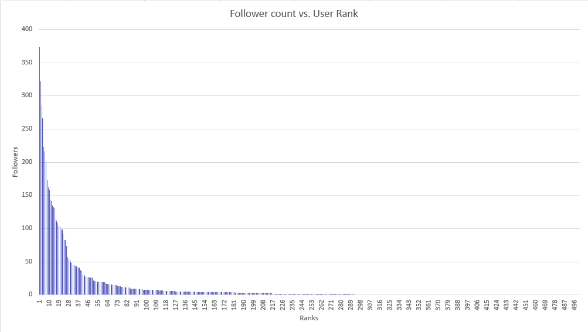
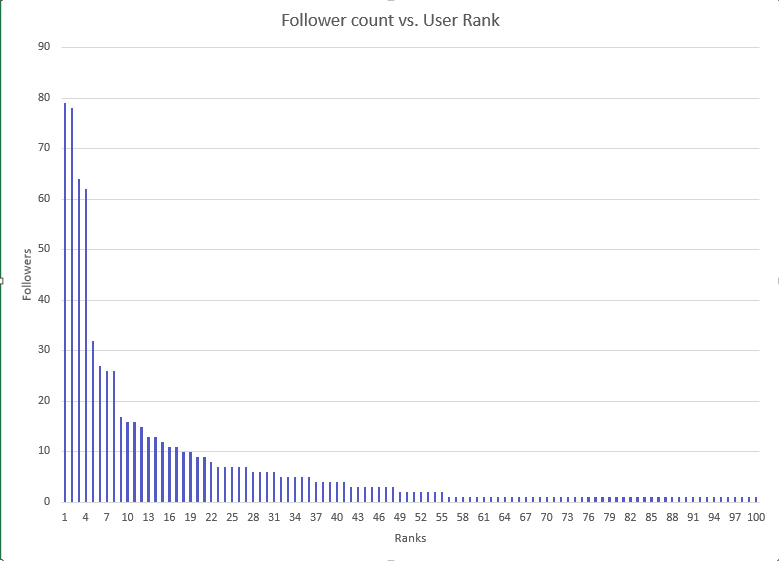
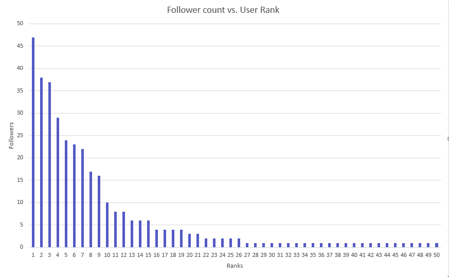

# Twitter Clone and a client tester/simulator using F# and Akka.net Actors
## Team Members: Akshay Kumar [UFID: 4679-9946] | Rajat Rai [UFID: 1417-2127]

#### Aim 
The goal of this first part of a two-part project is to implement the user/engine interaction and tests it using a simulator built over it. It's to be a Twitter clone with functionalities that mimic the real social networking service. It implements this using the concurrent programming model of F# [1], Akka Actors[2].

#### Architecture

The project has four key parts:
* The Simulator:
    * This module is an Akka actor that takes 3 command line inputs:
        * n: Number of users
        * maxSubs: Maximum number of subscribers for a user
        * maxTwts: Maximum number of Tweets for a user
* The Client:
    * This module is an Akka actor that mimics the functionality of the logged-in application provided to the user by the service. For example, Twitter for Web/Android.
* The Sever:
    * This is the component that forms the communication bridge between various signed-up users. All the tweets, follow notifications, etc. crossover from one user to another via the server as the mediator.
* The Database:
    * This component stores all the data related to hashtags, tweets, and users and also procedures to perform while modifying/adding them(reduces most of the load off the server).

#### Functionalities
We Provide the following functionalities:
* Signup for a new user
* Login/Logout for an existing user
* Follow for existing users from A to B
* Tweet/Retweet by an existing user by using @[username]
* Support for using hashtags in tweets and retweets by using #[hashtag]
* Support for Live Updates for logged-in users, on:
    * Tweets by users they follow
    * Tweets mentioning them
* Support for querying tweets by an existing user based on:
    * Tweets they made
    * Tweets by hashtags
    * Tweets by users they follow
    * Tweets mentioning them
* Population of a user's timeline and mentions by leveraging the above functionality.

#### Implementation
We start by creating a new server actor instance and then set up a simulation network using the three inputs described above. It calculates the number of followers and the number of tweets per user based on the input's Zipf distribution. All users are first registered using a username and password and then assigned their respective followers (one-by-one, closer to the real thing). After this, the users are logged in and  
#### How to run the program?
The program takes a total of three inputs in the order as mentioned.
        * n: Number of users
        * maxSubs: Maximum number of subscribers for a user
        * maxTwts: Maximum number of Tweets for a user

To run the code, navigate to the project root directory using the below command. The root directory is the one where the &nbsp;`simulator.fsx`&nbsp; file resides.

```bash
cd /path/to/Twitter-clone/
```
Now, you can run the program using the below command:

```bash
dotnet fsi --langversion:preview simulator.fsx [n] [maxSubs] [maxTwts]
```
#### Observations



The above table and graph show how much time it took for each user to receive a copy of a tweet on its logged-in client. Note that each user other than the one tweeting was subscribed to receive a tweet. We would also like to mention that, after the 5000 users mark, the CPU of the machine throttled because of heat, and hence the results after that are not on the same processor clock speed. We tested this on an Intel i7-8750H octa-core CPU.

#### Zipf Distribution of followers
In this project, we have simulated a Zipf distribution on the number of followers/subscribers and number of tweets made for all active users. Below figures are sample distribution graphs of followers from three of our test simulations.

* Total users: 500 | Max subscribers: 400


* Total users: 100 | Max subscribers: 100


* Total users: 50 | Max subscribers: 50


#### Results
Even though we could host a maximum of 100,000 users on the test machine, we are certain that this engine can easily do more because of its highly distributive nature, even within the engine.

#### Dependencies
* Akka.Cluster~>1.4.10
* Akka.FSharp~>1.4.12
* Akka.Remote~>1.4.12
* Akka.TestKit~>1.4.12
* MathNet.Numerics~>4.12.0

#### Tested and Dvelopend on OS
* GNU/Linux,Windows

#### References
[1] [F#](https://fsharp.org/docs/)
[2] [Akka.net](https://getakka.net/articles/intro/what-is-akka.html)

